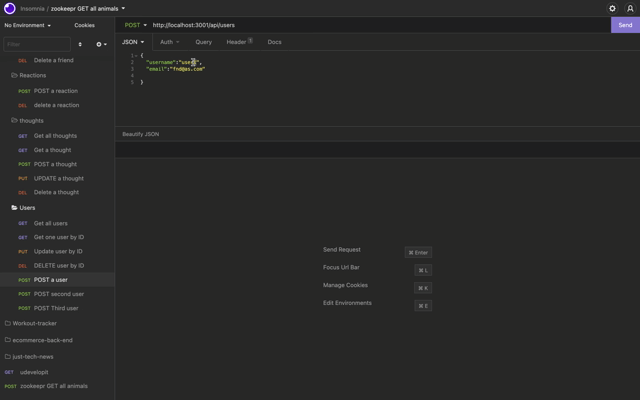
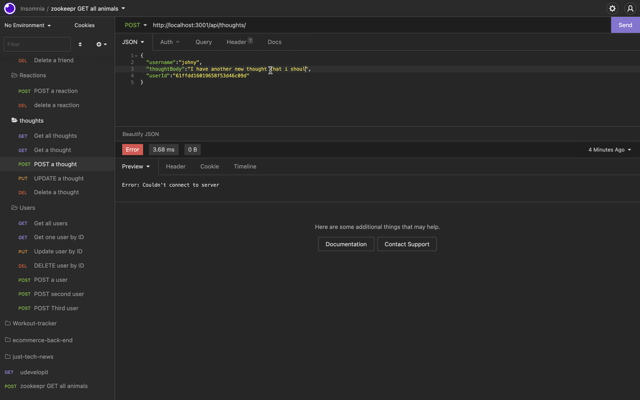

# nosql-social-api

# Description
This application is a social network web application where users can share their thoughts, react to friends’ thoughts, and create a friend list. This app uses Express.js for routing, MongoDB for database, and the Mongoose for object data modeling.

# Built with
* Node.js
* Express.js
* MongoDB
* Mongoose
* JavaScript

# Usage
* Download or clone the repo
* mongodb is required to run the application
* ```npm i``` to install all dependencies
* ```npm start``` to start server
* use insomnia to test routes

# Walk through video
[live video](https://watch.screencastify.com/v/iSTkZMRIGpaE3NRCphFz)
# Demo



# License
MIT License

Copyright (c) 2022 Grace Liu


